

The required textbook for the course is 

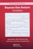

Other advanced textbooks are linked below and [some introductory textbooks are here](../stat544/textbook.html).

Hierarchical Modeling:

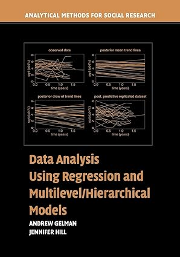

Time series:

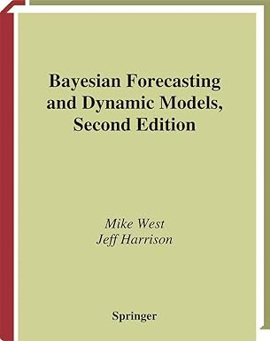
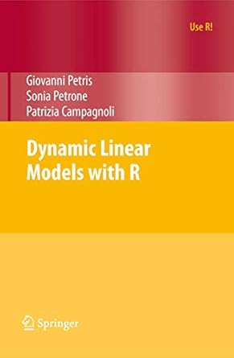
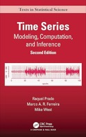

Spatial:

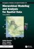
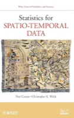

Nonparametrics:

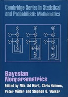

Computation:

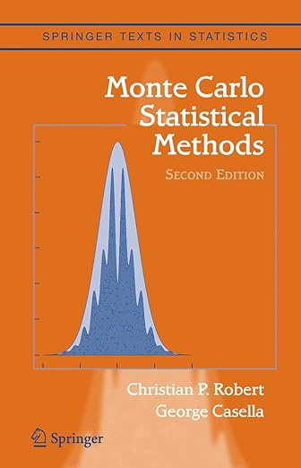
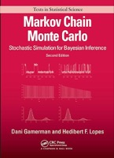

Decision theory:

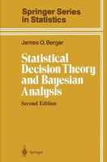

Theory:

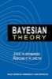

